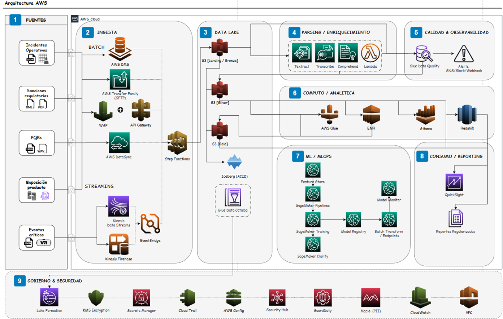

# nequi-ds-compliance-risk

# 🏗️ 1. Arquitectura Analítica en AWS para Gestión Integral de Riesgos
## Análisis Dinámico de Riesgos Corporativos

Este repositorio documenta el **diseño de una arquitectura analítica conceptual en AWS** orientada a la **gestión integral de riesgos**, soportando análisis dinámico, modelos de Machine Learning, cálculos actuariales básicos y un fuerte enfoque en **trazabilidad, explicabilidad y gobierno del dato**.

---

## 🎯 Objetivos del Sistema

- Centralizar y gobernar información de riesgo proveniente de múltiples fuentes.
- Diseñar y mantener una **Matriz de Riesgo Corporativa** actualizable dinámicamente.
- Desarrollar **modelos de Machine Learning** para estimar la **probabilidad de eventos de riesgo**.
- Ejecutar **cálculos actuariales simples** (frecuencia, severidad, pérdida esperada, reservas y escenarios).
- Garantizar **trazabilidad end-to-end**, **explicabilidad de modelos** y **cumplimiento regulatorio**.


---

## 🧩 Diagrama de Arquitectura




---

## 🗺️ Descripción de la Arquitectura por Fases

### 1️⃣ Fuentes de Datos
- Incidentes operativos  
- Sanciones regulatorias (PDF / XML)  
- PQRs (texto y audio WAV)  
- Exposición por producto  
- Eventos críticos (streaming)

Estas fuentes constituyen el origen de los eventos de riesgo y la exposición utilizada en la matriz de riesgo, los modelos predictivos y los cálculos actuariales.

---

### 2️⃣ Ingesta (Batch y Streaming)

**Batch**
- AWS DMS  
- AWS Transfer Family (SFTP)  
- AWS DataSync  
- API Gateway + WAF  

**Streaming**
- Kinesis Data Streams  
- Kinesis Firehose  
- EventBridge  

**Orquestación**
- AWS Step Functions

Esta capa garantiza una ingesta segura, desacoplada y totalmente trazable.

---

### 3️⃣ Data Lake (Bronze / Silver / Gold)

- **Bronze**: datos crudos e inmutables  
- **Silver**: datos limpios y estandarizados  
- **Gold**: datasets analíticos y de consumo  

Tecnologías:
- Amazon S3  
- Apache Iceberg (ACID, time-travel)  
- AWS Glue Data Catalog  

Aquí se almacenan la **matriz de riesgo corporativa**, resultados actuariales y features de ML.

---

### 4️⃣ Parsing y Enriquecimiento

- Textract (PDFs)  
- Transcribe (audio)  
- Comprehend (NLP)  
- AWS Lambda  

Convierte datos no estructurados en información analítica.

---

### 5️⃣ Calidad y Observabilidad

- Glue Data Quality / Deequ  
- Alertas SNS / Slack / Webhook  

Las métricas de calidad se almacenan en un **DQ Mart** consultable vía Athena o Redshift.

---

### 6️⃣ Cómputo y Analítica

- AWS Glue  
- Amazon EMR  
- Amazon Athena  
- Amazon Redshift  

Aquí se calculan:
- Matriz de riesgo corporativa  
- Cálculos actuariales  
- Data marts analíticos  

---

### 7️⃣ ML / MLOps

- Feature Store  
- SageMaker Pipelines  
- SageMaker Training  
- Model Registry  
- Batch Transform / Endpoints  
- Model Monitor  
- SageMaker Clarify  

Permite estimar probabilidades de eventos con explicabilidad y control de sesgo.

---

### 8️⃣ Consumo y Reporting

- Amazon QuickSight  
- Reportes regulados (PDF / CSV)  

Entrega información a comité de riesgos y auditoría.

---

### 9️⃣ Gobierno y Seguridad

- Lake Formation  
- KMS  
- Secrets Manager  
- CloudTrail  
- AWS Config  
- Security Hub  
- GuardDuty  
- Macie  
- CloudWatch  
- VPC / Endpoints  

Garantiza cumplimiento, seguridad y trazabilidad completa.

---

## 🔄 Flujo de Datos (Resumen)

1. Fuentes → Ingesta → S3 Bronze  
2. Parsing / Calidad → S3 Silver  
3. Analítica / ML → S3 Gold / Redshift  
4. Consumo → Dashboards y reportes  

---

## ✅ Consideraciones de Diseño

- Arquitectura event-driven
- Separación Bronze / Silver / Gold
- Time-travel y reproducibilidad con Iceberg
- Seguridad y gobierno alineados a entornos regulados
 
# 2. Matriz de Riesgo + ML Supervisado

Dataset esperado:

- `risk_id`, `process`, `risk_type`, `events_last_3y`, `total_loss_last_3y`, `controls_level`, `critical_flag`

Parte A – Matriz de Riesgo:

- Calcular frecuencia anual (`events_last_3y / years_window`)
- Calcular severidad promedio (`total_loss_last_3y / events_last_3y`, safe divide)
- Calcular pérdida esperada anual (freq * severity)
- Asignar probabilidad 1–5 (método `quantile` o `fixed` según `RiskMatrixConfig`)
- Asignar impacto 1–5 (método `quantile` o `fixed`)
- Construir matriz 5x5 (conteos y expected loss)
- Agregar por `process` y `risk_type` (agregaciones clave)
- Incluir tests unitarios para cada componente (métricas, scoring, matriz, agregaciones)

Parte B – Modelo Supervisado:

- Entrenar un modelo simple para predecir `critical_flag` (baseline: regresión logística, alternativa: RandomForest o XGBoost)
- Explicar features y proceso: uso `FeatureSpec`, preprocesador (imputación, OHE), y técnicas de explicación ligera (coeficientes, permutation importance; opcional: SHAP)
- Métricas: accuracy, precision, recall, f1, ROC-AUC y PR-AUC; priorizar PR-AUC en datasets desbalanceados
- Manejo de desbalanceo: `class_weight='balanced'`, opción `SMOTE` dentro de pipeline, o `scale_pos_weight` para XGBoost

Estructura del proyecto:

- `risk_matrix/` : implementación de la Matriz de Riesgo
	- `src/` : código (pipeline, metrics, scoring, matrix, aggregation, config)
	- `tests/` : tests de unidad para la matriz
- `supervised_model/` : pipeline de ML supervisado
	- `src/ml/` : `features.py`, `train.py`, `model.py` (ModelConfig)
	- `src/cli.py` : CLI para entrenar y guardar artefactos
	- `tests/` : tests de unidad para el entrenamiento
- `data/raw/` : datasets de ejemplo (`dataset_dummy_compliance.csv`)
- `files/` : outputs generados por los CLIs (metrics, modelos, PNGs)

Cómo ejecutar (PowerShell):

- Instalar dependencias y activar el virtualenv (si no está creado):
```powershell
python -m venv .venv
.\\.venv\\Scripts\\Activate.ps1
pip install -r requirements.txt
```  

```  

- Ejecutar tests (desde la raíz del repo):
```powershell
# Ejecuta todos los tests
python -m pytest -q

# Ejecuta solo tests de risk_matrix
python -m pytest risk_matrix/tests/test_matrix.py -q

# Ejecuta solo tests de supervised_model
$env:PYTHONPATH="supervised_model"
python -m pytest supervised_model/tests/test_ml_train.py -q
```

- Pipeline Matriz de Riesgo (genera CSVs en `files/output`):
```powershell
# desde la raíz del repo
.\\.venv\\Scripts\\python.exe -m risk_matrix.src.cli --input data/raw/dataset_dummy_compliance.csv --out files/output --prob-method quantile --impact-method quantile
```

- Entrenar modelo supervisado (usa el CSV generado o el raw si ya contiene las columnas opcionales):
```powershell
# entrenar con CSV enriquecido
$env:PYTHONPATH="supervised_model"
.\\.venv\\Scripts\\python.exe -m src.cli --input files/output/risk_metrics.csv --out files/ml_output --model-type logreg

# usar XGBoost
.\\.venv\\Scripts\\python.exe -m src.cli --input files/output/risk_metrics.csv --out files/ml_output_xgb --model-type xgb
```

- Opción para ejecutar internamente la generación de metrics antes del entrenamiento:
```powershell
# Ejecuta risk_matrix primero y luego entrena
.\\.venv\\Scripts\\python.exe -m risk_matrix.src.cli --input data/raw/dataset_dummy_compliance.csv --out files/output
$env:PYTHONPATH="supervised_model"
.\\.venv\\Scripts\\python.exe -m src.cli --input files/output/risk_metrics.csv --out files/ml_output --model-type rf

``` 


# 3. Optimización Bajo Restricciones

**Contexto**
- Score $s\in[0,1]$ por registro. Clasificación objetivo: `bajo` (70%), `medio` (20%), `alto` (10%).
- Restricciones operacionales: maximizar detección de `críticos` dentro de `alto`, mantener falsos positivos (FP) en `alto` < 15%, no se puede reentrenar el modelo (solo ajustar cortes).

**Notación y función objetivo**
- Sea $s_i$ el score y $y_i\in\{0,1\}$ la etiqueta (1=crítico). Definimos dos umbrales $t_1,t_2$ con $0\le t_1<t_2\le1$:
	- `bajo`: $s<t_1$ (≈70%)
	- `medio`: $t_1\le s<t_2$ (≈20%)
	- `alto`: $s\ge t_2$ (≈10%)
- Objetivo: maximizar el recall de críticos ubicados en `alto`:
$$\max_{t_1,t_2} R_{alto}(t_2)=\frac{\sum_i \mathbb{1}(y_i=1)\,\mathbb{1}(s_i\ge t_2)}{\sum_i \mathbb{1}(y_i=1)}$$

**Restricciones**
- Proporciones objetivo (con tolerancia $\epsilon$, p.ej. $\epsilon=0.02$):
$$\frac{1}{N}\sum_i\mathbb{1}(s_i<t_1)\approx0.70,\quad\frac{1}{N}\sum_i\mathbb{1}(t_1\le s_i<t_2)\approx0.20,\quad\frac{1}{N}\sum_i\mathbb{1}(s_i\ge t_2)\approx0.10$$
- Falsos positivos en `alto`:
$$\frac{FP_{alto}}{N_{non}}\le 0.15$$
- Dominio: $0\le t_1<t_2\le1$. Solo se permiten cambios en los cortes (no reentrenamiento).

**Método de optimización (práctico y explicable)**
- Recomendado: búsqueda de cuadrícula (grid-search) sobre percentiles de score + reglas de selección.
	1. Punto de partida: $t_1^{(0)}=Q_{0.70}$, $t_2^{(0)}=Q_{0.90}$.
	2. Definir grid en percentiles (p.ej. p1=50..80, p2=85..99). Para cada par (p1,p2) calcular $t_1,t_2$ y métricas: `recall_high`, `fp_rate_high`, proporciones.
	3. Filtrar soluciones que cumplan restricciones (proporciones dentro de tolerancia y `fp_rate_high` ≤ 0.15).
	4. Seleccionar la solución factible con mayor `recall_high`. Si no existe, seleccionar la que cumpla `fp_rate_high` y maximice `recall_high`, o presentar trade-off.
	5. Alternativa: formulación con penalización:
	$$\max_{t_1,t_2}\;R_{alto}(t_2)-\lambda\max(0,FP_{alto}/N_{non}-0.15)-\mu\,penalty\,,$$
	optimizado por métodos de caja negra (COBYLA) o grid-search; preferir grid-search por auditabilidad.

**Validación y control**
- Hold-out temporal o estratificado distinto al que se usó para selección. Nunca validar sobre el mismo conjunto de ajuste.
- Backtesting: aplicar umbrales en ventanas históricas para medir estabilidad y deriva.
- Bootstrap (p.ej. 500–1000 resamples) para estimar intervalos de confianza de `recall_high` y `fp_rate_high`.
- Curvas de sensibilidad: variar $t_2$ y $t_1$ alrededor de la solución y mostrar efecto en `recall_high` vs `fp_rate_high`.
- Métricas a reportar: `recall_high`, `precision_high`, `fp_rate_high`, proporciones reales (bajo/medio/alto), PR-AUC y ROC-AUC globales.
- Controles de fairness: checks por subgrupo y revisión manual de muestras en `alto` y falsos positivos.

**Implementación operativa**
- Ejecutar script de optimización sobre dataset de validación (ejemplo: `tools/threshold_optimizer.py`).
- Guardar artefactos: `threshold_best.json`, `threshold_grid_results.csv`, `annotated_scores.csv`, imágenes de trade-off y bootstrap.
- Versionar el paquete de configuración (umbral, dataset usado, fecha, métricas) y exigir aprobación de Riesgos + Legal antes de producción.
- Monitor diario en producción: `FP_rate_alto`, `Recall_alto`, volumen de casos `alto`; rollback automático si `FP_rate_alto` excede 15%.

**Comunicación a Riesgos / Legal / Regulador (texto breve listo para presentar)**
- Objetivo: Ajustar únicamente los umbrales de clasificación del score para priorizar la detección de casos críticos en la categoría `alto`. No se reentrena ni modifica el modelo base.
- Beneficios: intervención rápida, auditable y reversible que permite concentrar la revisión manual en el 10% más alto del score.
- Garantías: todos los umbrales se validan con hold-out y backtesting; se calculan intervalos por bootstrap; se registra versión y dataset; cualquier cambio requiere aprobación formal.
- Reglas operativas:
	- Umbrales propuestos se evaluarán en entorno de pruebas durante 1 mes con monitoreo diario.
	- Si durante producción `FP_rate_alto` > 15%, se revierte el cambio e inicia investigación.
	- Se mantendrá evidencia para auditoría (dataset, código, versión de umbrales, registros de aprobación).
- Riesgos y trade-offs: mejorar `recall_high` puede aumentar carga operativa por revisiones manuales; presentamos curvas de trade-off y estimaciones de impacto operativo.

---

# 4. Problema de Escenario – Gobernanza y Conflictos

### Escenario
Las áreas de **Riesgos**, **Legal** y **Actuaría** identifican discrepancias entre los criterios tradicionales (reglas expertas, matrices estáticas, supuestos actuariales) y los resultados generados por un **modelo de Machine Learning** para evaluación de riesgo. Estas diferencias generan fricción operativa, dudas sobre la validez del modelo y riesgos de cumplimiento regulatorio.  

---

### ¿Cómo gestionar desacuerdos entre estos frentes?

- Establecer un **foro formal de decisión** (Risk & Model Committee) con representantes de Riesgos, Legal, Actuaría, Data Science y Compliance.
- Separar claramente **roles y responsabilidades**:
  - Riesgos: apetito de riesgo y uso del output.
  - Actuaría: coherencia estadística y supuestos.
  - Data Science: desempeño, estabilidad y sesgo del modelo.
  - Legal/Compliance: alineación regulatoria y trazabilidad.
- Utilizar **evidencia cuantitativa** para la discusión:
  - Comparación ML vs. criterios tradicionales (backtesting).
  - Análisis de impacto en métricas clave (pérdida esperada, reservas, solvencia).
- Documentar explícitamente **excepciones y overrides**, evitando decisiones ad-hoc.

---

### ¿Cómo definir gobernanza?

- Implementar un **framework de gobernanza de modelos** que incluya:
  - Ciclo de vida del modelo (diseño, validación, despliegue, monitoreo, retiro).
  - Validación independiente (Model Validation / Second Line).
  - KPIs de seguimiento: performance, estabilidad, drift, explainability.
- Definir al ML como **modelo complementario**, no sustitutivo:
  - ML apoya la toma de decisiones.
  - La decisión final permanece bajo responsabilidad del negocio.
- Mantener **versionamiento y control de cambios**:
  - Cambios en features, bins, thresholds o datasets deben ser aprobados y auditables.

---

### ¿Cómo explicar al regulador?

- Presentar el modelo como un **mecanismo de apoyo a la gestión del riesgo**.
- Enfatizar:
  - Explicabilidad del modelo (features, importancia, lógica de scoring).
  - Consistencia con criterios tradicionales (alineación conceptual).
  - Evidencia empírica de mejora (menor error, mejor detección, reducción de pérdidas).
- Proveer documentación clara:
  - Supuestos del modelo.
  - Limitaciones conocidas.
  - Controles implementados (monitoreo, overrides, revisión humana).
- Demostrar que existe **gobernanza activa**, trazabilidad y accountability, alineada con principios de gestión prudencial y regulatoria.

---

**Conclusión:** 
La decisión no es imponer el modelo ML, sino integrarlo dentro de una gobernanza sólida, donde actúe como una herramienta cuantitativa adicional, validada, explicable y supervisada, capaz de convivir con los enfoques tradicionales y cumplir con las expectativas regulatorias.
